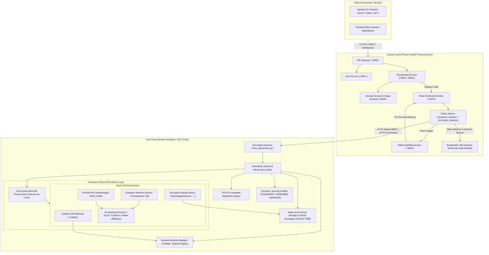
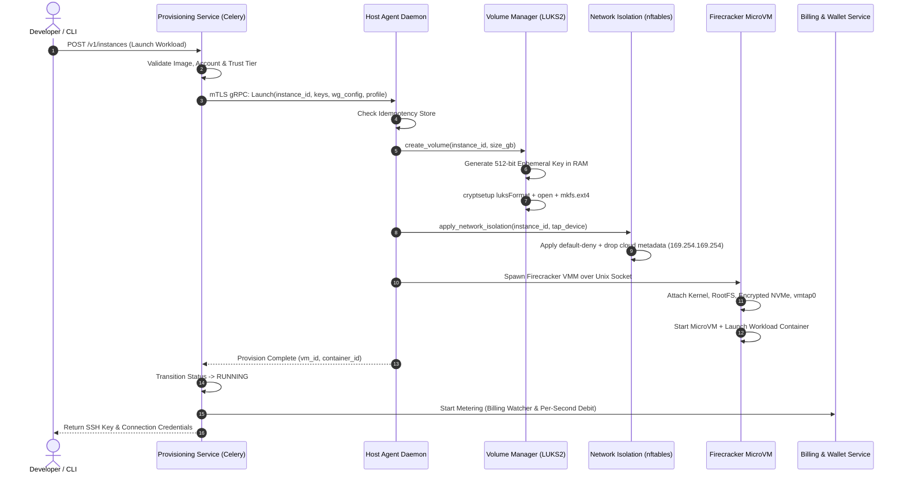
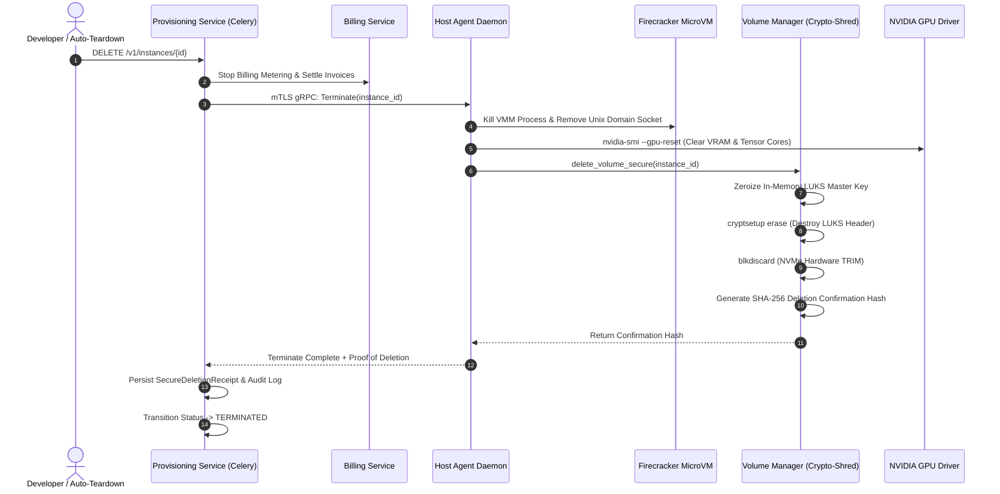

# Kynetic AI — Container Implementation Flow & Architecture

This document details the end-to-end container and microVM execution lifecycle, isolation guarantees, and architectural components across the **Control Plane** (`provisioning_service`, `security_service`, `api_gateway`) and the **Host Execution Plane** (`host_agent`).

---

## 1. System Architecture Diagram



---

## 2. Container Execution Architecture

The system uses a **Container-inside-Firecracker MicroVM** architecture to deliver multi-tenant hardware isolation, cryptographic data protection, and GPU acceleration.

```
+-----------------------------------------------------------------------------------+
| Host Physical Node (Ubuntu / Debian + KVM + NVIDIA Driver)                        |
|                                                                                   |
|  +-----------------------------------------------------------------------------+  |
|  | Host Agent Daemon (Python + Root / Sudo Daemon)                            |  |
|  |  * mTLS gRPC Server with Idempotency Token Validation                       |  |
|  |  * TPM 2.0 Remote Attestation Engine                                        |  |
|  |  * nftables Default-Deny Firewall Manager                                  |  |
|  |  * LUKS2 Master Key Generator (Ephemeral 512-bit AES-XTS in RAM)           |  |
|  +-----------------------------------------------------------------------------+  |
|                                     |                                             |
|                                     v (Spawn per instance via UDS)                |
|  +-----------------------------------------------------------------------------+  |
|  | Firecracker MicroVM Process (VMM)                                            |  |
|  |  - Kernel: `/opt/kynetic/vmlinux`                                           |  |
|  |  - RootFS: `/opt/kynetic/rootfs.ext4`                                        |  |
|  |  - Attached Block: `/mnt/kynetic_nvme/vol-{instance_id}.img` (LUKS2 mapped)  |  |
|  |  - Net Device: `vmtap0` (Bridged + nftables isolated)                       |  |
|  |  - Hardware VMM Memory & vCPU allocation                                   |  |
|  |                                                                             |  |
|  |  +-----------------------------------------------------------------------+  |  |
|  |  | Guest OS Container Execution Environment                             |  |  |
|  |  |                                                                       |  |  |
|  |  |   Workload Container Profile (HARDENED / VERIFIED):                   |  |  |
|  |  |   - Seccomp: Custom strict syscall filtering                          |  |  |
|  |  |   - AppArmor: `kynetic-hardened` profile                              |  |  |
|  |  |   - Filesystem: Read-Only Root (`read_only_root_fs=true`)              |  |  |
|  |  |   - Capabilities: `cap_drop: [ALL]`, `cap_add: [CHOWN, SETUID, ...]` |  |  |
|  |  |   - Privilege Escalation: `no_new_privileges=true`                    |  |  |
|  |  |   - Hardware Passthrough: NVIDIA GPU with NVML isolation              |  |  |
|  |  |   - Target: vLLM / JupyterLab / PyTorch / ComfyUI / Custom Script     |  |  |
|  |  +-----------------------------------------------------------------------+  |  |
|  +-----------------------------------------------------------------------------+  |
+-----------------------------------------------------------------------------------+
```

---

## 3. End-to-End Container Implementation Lifecycle Flow

### Phase A: Request & Pre-Flight Validation
1. **Developer Request**: Client initiates launch via `POST /v1/instances` or `kynetic launch`.
2. **Pre-Flight Inspection** (`validators.py`):
   * Verifies developer account status (`ACTIVE`) and wallet balance/credit readiness.
   * Validates target host health score and heartbeat recency (`< 120s`).
   * Validates listing capacity, VRAM, and trust-tier compatibility.
3. **Security Gate & Image Scanner** (`security_service/image_scanner.py`):
   * Inspects Docker base image for critical vulnerabilities (CVE scanning).
   * Verifies image signature against trusted Sigstore/Cosign public roots.
   * Rejects untrusted or compromised images prior to node scheduling.

---

### Phase B: Control Plane Preparation & Key Material Generation
1. **State Transition**: `InstanceStatus.pending` $\rightarrow$ `InstanceStatus.provisioning`.
2. **Ephemeral SSH Keypair**:
   * Generates disposable Ed25519/RSA keypair in memory.
   * Encrypts private key using Fernet encryption (`ssh_keys.py`) before database persistence.
3. **WireGuard VPN Configuration**:
   * Allocates dedicated subnet IP for tenant isolation (`wireguard.py`).
   * Generates peer configuration for secure mesh tunneling.
4. **Celery Worker Dispatch**:
   * Async task `provision_instance` executes and calls `AgentProtocol.provision()` over mutual TLS (mTLS).

---

### Phase C: Host Plane Workload Instantiation


1. **Idempotency Gate** (`idempotency_store.py`):
   * Validates command UUID to guarantee at-most-once execution across network retries.
2. **Ephemeral Volume Setup** (`volume_manager.py`):
   * Allocates NVMe backing image `/mnt/kynetic_nvme/vol-{instance_id}.img`.
   * Formats with **LUKS2 (AES-XTS 512-bit)** with an in-memory key never written to disk.
   * Mounts formatted ext4 storage partition into the instance mountpoint.
3. **Network Isolation Enforcement** (`network_isolation.py`):
   * Generates per-instance `nftables` table (`kynetic_inst_{id}`).
   * Policy: `DROP` on `input`, `output`, and `forward`.
   * Explicitly drops Cloud Metadata queries (`169.254.169.254`, `169.254.169.253`).
   * Explicitly blocks private cross-tenant RFC1918 subnets (`10.0.0.0/8`, `172.16.0.0/12`, `192.168.0.0/16`).
   * Allows outbound internet and WireGuard/mTLS relay traffic only.
4. **Security Profile Injection** (`container_profiles.py`):
   * Applies selected profile (`STANDARD`, `HARDENED`, or `VERIFIED`).
   * In `HARDENED`/`VERIFIED` mode: enforces read-only root FS, drops all capabilities except `CHOWN`/`SETUID`/`SETGID`, applies custom seccomp filters.
5. **MicroVM Boot** (`firecracker.py`):
   * Configures Firecracker REST API over `/tmp/firecracker-{instance_id}.sock`.
   * Binds vCPUs, RAM, vmlinux kernel, root filesystem, and encrypted drive block.
   * Starts VM process (`InstanceAction` `InstanceStart`).

---

### Phase D: Active Runtime & Real-Time Monitoring
* **Status**: `InstanceStatus.running`.
* **Billing Watcher** (`billing_watcher.py`):
   * Ticks per-second wallet deductions against active balance.
   * Emits low-balance warnings or triggers graceful stop if balance is exhausted.
* **Health & Heartbeat Monitoring** (`monitoring_service` & `host_agent/diagnostics.py`):
   * Streams GPU utilization, VRAM temperature, memory saturation, and NVML metrics.
   * Monitored by composite Runtime Risk Engine and Abuse Detector.

---

### Phase E: Teardown, GPU Reset & Cryptographic Shredding


1. **Termination Dispatch**:
   * Celery executes `terminate_instance`. Billing watcher is halted and settled.
2. **Process Teardown**:
   * Firecracker VMM process terminated; UDS socket `/tmp/firecracker-{instance_id}.sock` unlinked.
3. **GPU State Sanitization**:
   * Issues GPU hardware reset (`nvidia-smi --gpu-reset` / NVML) to purge residual GPU VRAM and compute buffers.
4. **Cryptographic Storage Shredding & TRIM** (`volume_manager.py`):
   * **Key Zeroization**: Memory-held encryption key bytes overwritten with zero bytes.
   * **Header Destruction**: Executes `cryptsetup erase` to render underlying data mathematically unrecoverable.
   * **Media TRIM**: Executes `blkdiscard` on host NVMe blocks.
   * **Receipt Creation**: Generates SHA-256 confirmation hash recorded in `SecureDeletionReceipt` audit table.

---

## 4. Key Source Code References

| Component | File Path | Key Responsibilities |
| :--- | :--- | :--- |
| **Provisioning Celery Tasks** | [`backend/services/provisioning_service/tasks.py`](file:///Users/divyebhatnagar/Desktop/KyneticSoftware/kynetic-ai/backend/services/provisioning_service/tasks.py) | Full instance state machine, async provisioning, termination flow, billing hooks |
| **Firecracker MicroVM Wrapper** | [`backend/host_agent/firecracker.py`](file:///Users/divyebhatnagar/Desktop/KyneticSoftware/kynetic-ai/backend/host_agent/firecracker.py) | Spawns VMM, configures UDS REST API, attaches drives/TAP devices, boots VM |
| **Container Profiles** | [`backend/host_agent/container_profiles.py`](file:///Users/divyebhatnagar/Desktop/KyneticSoftware/kynetic-ai/backend/host_agent/container_profiles.py) | STANDARD, HARDENED, and VERIFIED seccomp/AppArmor/capability configurations |
| **Volume Manager & Crypto-Shred** | [`backend/host_agent/volume_manager.py`](file:///Users/divyebhatnagar/Desktop/KyneticSoftware/kynetic-ai/backend/host_agent/volume_manager.py) | In-memory LUKS2 AES-XTS key creation, cryptsetup formatting, TRIM, key zeroization |
| **Network Isolation Engine** | [`backend/host_agent/network_isolation.py`](file:///Users/divyebhatnagar/Desktop/KyneticSoftware/kynetic-ai/backend/host_agent/network_isolation.py) | Generates and applies per-instance default-deny nftables rulesets |
| **Host Command Listener** | [`backend/host_agent/command_listener.py`](file:///Users/divyebhatnagar/Desktop/KyneticSoftware/kynetic-ai/backend/host_agent/command_listener.py) | mTLS gRPC/HTTP servicer for signed Launch, Stop, and Terminate operations |
| **Pre-Flight Validators** | [`backend/services/provisioning_service/validators.py`](file:///Users/divyebhatnagar/Desktop/KyneticSoftware/kynetic-ai/backend/services/provisioning_service/validators.py) | Health, heartbeats, wallet balance, and listing availability checks |
| **WireGuard & SSH Helpers** | [`backend/services/provisioning_service/wireguard.py`](file:///Users/divyebhatnagar/Desktop/KyneticSoftware/kynetic-ai/backend/services/provisioning_service/wireguard.py), [`ssh_keys.py`](file:///Users/divyebhatnagar/Desktop/KyneticSoftware/kynetic-ai/backend/services/provisioning_service/ssh_keys.py) | Ephemeral mesh IP allocation, peer config generation, encrypted private key storage |
