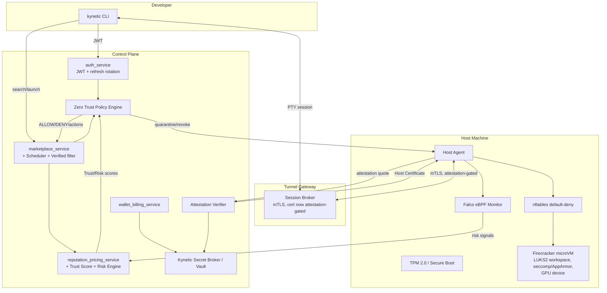

# Kynetic AI — Security Enhancements Implementation Plan v2

### Principal Security Architecture Audit & Multi-Tenant GPU Marketplace Security Design

> **Honest disclosure, required before anything else in this document:** No source repository, codebase, infrastructure-as-code, CI/CD configuration, or deployed environment exists for Kynetic AI at the time of this audit. Everything produced for this platform to date — the Technical Design Document & Engineering Implementation Plan v6, Implementation Plan v8, and the original `Kynetic_AI_Security_Architecture.md` — is **planning documentation**, not code. Per this document's own governing rule ("never claim a feature exists without repository evidence," "do not hallucinate implementation"), the correct and only honest finding of Part 1's audit is: **there is nothing to inspect yet, and therefore nothing is IMPLEMENTED.** Every item below is classified accordingly. This is not a weakness in the audit — it is the audit's most important finding, and it reframes this document's purpose: not "here is what's broken," but **"here is the security architecture that must be built alongside the platform, in the right order, before any real customer workload runs on real host hardware."**
>
> This plan **extends** (does not replace) the MVP-tier security pillars already scoped in `Kynetic_AI_Security_Architecture.md` and TDD v6 §14/Phase J, and follows the same Python-first, incremental-build philosophy already established for the platform.

---

## PART 1–2 — Security Inventory & Classification

Since no code exists, the inventory below classifies every requested capability against the **documentation baseline** (what prior planning documents describe) versus **actual implementation** (none). This table is the ground truth this whole plan is built from — every later Part references it instead of re-litigating status.

| Capability | Status | Evidence | Notes |
|---|---|---|---|
| Short-lived JWT | DOCUMENTED ONLY | TDD v6 §14.1 | Specified as access+refresh via `python-jose`; no code exists |
| Single-use refresh tokens / rotation | MISSING | — | Not specified in any prior doc at the single-use/rotation level of detail; must be designed (§ Part 3 below) |
| mTLS (Host Agent ↔ Gateway) | DOCUMENTED ONLY | TDD v6 §3.2, §14.1 | Core to the reverse-dial architecture; certificate issuance/rotation described conceptually, not implemented |
| RBAC | DOCUMENTED ONLY | TDD v6 §14.1 | `developer`/`host`/`admin` roles named; no ABAC layer, no policy engine |
| Audit logs | DOCUMENTED ONLY | `audit_logs` table schema exists in TDD v6 §12.1 | No hash-chaining, no immutability enforcement mechanism beyond "append-only at the application layer" |
| Container/microVM isolation | DOCUMENTED ONLY | TDD v6 §5, §6, Security Architecture Pillar 1 | Firecracker + Docker specified; no seccomp/AppArmor/capability-dropping profile design exists yet |
| LUKS2 storage encryption | MISSING | — | Prior docs specify "cryptographic deletion / key destruction" at a conceptual level only; no LUKS2, no media-aware design |
| Trivy / Semgrep / SAST | DOCUMENTED ONLY | Security Architecture Pillar 9 (image scanning, generically) | No specific tool named or wired into any pipeline |
| Seccomp-BPF / gVisor / Kata | MISSING | — | Not previously specified at all |
| TPM 2.0 / attestation / SPIFFE-SPIRE | MISSING | — | Not previously specified at all |
| GPU isolation (MIG, device permissions) | MISSING | — | Prior docs assume "GPU passthrough works," never analyze isolation mechanism |
| Confidential computing | DOCUMENTED ONLY (deferred) | TDD v6 §14 deferred-items list; Security Architecture "Extreme/Future tier" | Explicitly out of scope for MVP in prior docs — correctly so |
| Secrets management | PARTIALLY DOCUMENTED | TDD v6 §14.3 ("dedicated secrets manager… never hardcoded") | Names the requirement, no broker design, no rotation mechanism |
| eBPF/Falco runtime detection | MISSING | — | Prior docs mention "runtime monitoring" generically (Security Architecture Pillar 5), no specific technology |
| SBOM / image signing (Cosign/Sigstore) | MISSING | — | Prior docs mention "basic image scanning + signing" generically, no tool chain specified |
| Network policy / default-deny egress | DOCUMENTED ONLY | TDD v6 §5.4, §14.4 | Stated as a principle, no CNI/nftables/NetworkPolicy design |

**Conclusion of Part 1–2:** Kynetic AI is at **Phase 0 (pre-implementation) for every security capability in scope of this document.** This plan is therefore the design specification for Phases 1 onward of the security build-out — not a remediation plan for existing gaps in running code.

---

## PART 3 — Baseline Security Features: Detailed Findings

| # | Feature | Implemented? | Where | Security benefit if built as designed | What it does NOT mitigate | What's missing to build it |
|---|---|---|---|---|---|---|
| 1 | Short-lived JWT | No | — | Limits the blast radius of a leaked access token to a short window | Refresh-token theft, session fixation | Concrete TTL policy (recommend 15 min access / 30 day refresh), signing-key rotation plan |
| 2 | Single-use refresh tokens | No | — | Detects token replay (a reused refresh token is a compromise signal) | Nothing if not paired with rotation (#3) | Token-family tracking table, reuse-detection logic that revokes the whole family on replay |
| 3 | Refresh-token rotation | No | — | Limits a stolen refresh token's usable lifetime to one rotation cycle | Doesn't stop theft, only limits its window | `refresh_tokens` schema (token_hash, family_id, issued_at, used_at, revoked_at) + rotation endpoint logic |
| 4 | SHA-256 hash-chained audit logs | No | — | Detects tampering with historical audit records after the fact | Doesn't prevent a live attacker with DB write access from chaining a forged entry forward — needs periodic external checkpointing to fully close this | `prev_hash`/`entry_hash` columns on `audit_logs`, a checkpoint job exporting periodic chain roots to external immutable storage (§ Part 20) |
| 5 | LUKS2 ephemeral storage encryption | No | — | Ensures a workspace volume is unreadable without its key, making deletion == key destruction rather than relying on filesystem-level delete | Doesn't protect against an attacker with access *during* the instance's active lifetime | Per-instance LUKS2 volume provisioning in the Host Agent's Docker/Firecracker Lifecycle Manager, per-instance key generation/storage |
| 6 | Storage sanitization ("3-pass DoD wipe") | No, and the phrase itself is the wrong target | — | See Part 4 — this entire approach is superseded | N/A | Full redesign, not an implementation of the stated feature |
| 7 | Trivy vulnerability scanning | No | — | Catches known-CVE vulnerable packages in template/base images before they run | Zero-days, logic flaws, supply-chain-injected malicious code not yet in a CVE database | CI pipeline step + admission-time scan gate (§ Part 13) |
| 8 | Semgrep SAST | No | — | Catches common insecure code patterns (injection, hardcoded secrets, unsafe deserialization) in Kynetic's own codebase pre-merge | Runtime/config-only vulnerabilities, logic errors Semgrep's rule set doesn't cover | CI pipeline step, custom rule set for Python/FastAPI-specific patterns |
| 9 | Seccomp-BPF | No | — | Restricts the syscall surface available to a workload container, reducing kernel-exploit attack surface | Doesn't stop attacks entirely within the allowed syscall set | Profile design (§ Part 12), integration into container launch in Provisioning Module |
| 10 | gVisor | No | — | Userspace kernel intercepts syscalls, adding a strong isolation layer beyond seccomp alone | GPU passthrough compatibility is limited/nonexistent for gVisor in most configurations — **cannot be applied uniformly to GPU workloads** | Selective use only for CPU-only/non-GPU workload tiers (§ Part 12) |
| 11 | Kata Containers | No | — | VM-per-container isolation, stronger boundary than namespaces alone | Kynetic already uses Firecracker microVMs at the instance level — Kata would be a redundant second VM layer for GPU workloads specifically; evaluate only for non-GPU multi-tenant density scenarios | Needs an explicit "is this redundant with the existing microVM boundary" analysis before building (see recommendation in Part 12) |
| 12 | Custom AppArmor profiles | No | — | Restricts file/network/capability access per container beyond Docker defaults | Not effective alone against kernel-level exploits | Profile authoring per workload template (§ Part 12) |
| 13 | TPM 2.0 | No | — | Hardware root of trust for host identity and boot-state measurement | Only as strong as the supply chain of the physical host hardware — cannot help on consumer hosts without a TPM chip present | Full design in Part 5; **critical caveat: many consumer gaming PCs targeted as hosts do have TPM 2.0 (Windows 11 requirement) but Linux/Firecracker-hosting configurations must be verified to expose it** |
| 14 | TPM-backed host identity | No | — | Binds a host's cryptographic identity to physical hardware, resistant to credential copying | Doesn't work on hosts without a TPM — needs a fallback trust tier | Part 5 |
| 15 | Certificate pinning / host authentication | Partially documented | TDD v6 §14.1 (mTLS described) | Prevents a MITM'd or spoofed Gateway from impersonating the real one to a Host Agent | Doesn't protect against a compromised-but-legitimate Gateway node | Concrete pinning implementation in the Host Agent's Secure Comms Module |

---

## PART 4 — Storage Sanitization Redesign (Media-Aware)

**Why "3-pass DoD wipe" is the wrong target:** Repeated-overwrite sanitization (DoD 5220.22-M and similar standards) was designed for magnetic HDDs, where a write doesn't perfectly erase the prior magnetic state and multiple passes reduced (not eliminated) forensic recoverability. On modern NVMe/SSD media this approach is **actively counterproductive**: flash translation layers (FTL) remap logical-to-physical blocks, wear-leveling means a logical overwrite frequently does not touch the same physical NAND cells as the original write, and over-provisioned/spare blocks holding the original data may never be touched by a filesystem-level overwrite at all. Multiple passes add wear and latency without a corresponding security guarantee on flash media.

**Kynetic's correct model: encrypt-by-default, delete-by-key-destruction, verify-by-device-command.**

1. **Per-instance encryption at provisioning time (primary control):** every ephemeral workspace volume is a **LUKS2**-encrypted volume, keyed with a freshly generated, per-instance key held only in the Host Agent's memory (never written to disk in plaintext, never transmitted off the host). This means the *default* state of the data, from the moment the instance starts, is ciphertext — sanitization becomes a key-management problem, not a data-remanence problem.
2. **Termination = cryptographic erase (primary deletion mechanism):** on `terminate`, the Host Agent destroys the in-memory LUKS2 key. Without the key, the volume's ciphertext is permanently unrecoverable regardless of what remains on the physical NAND — this is the deletion event that matters, and it is instantaneous (no multi-pass overwrite required).
3. **Device-supported sanitize as defense-in-depth (secondary control):** where the underlying NVMe device supports it, additionally issue an **NVMe Format with Secure Erase (Crypto Erase or User Data Erase, `nvme format --ses=1` or `--ses=2`)** or **ATA Sanitize** command against the reclaimed physical blocks — this is the media-native, vendor-guaranteed sanitize operation, distinct from and stronger than any filesystem-level overwrite scheme. Support for this command must be **detected per-device at host onboarding** (not assumed) and recorded in `host_hardware` — a host whose storage doesn't support device-level sanitize relies solely on control #1/#2, which is already sufficient given per-instance encryption.
4. **Verification, not blind trust:** the Host Agent's Resource Cleanup Module must confirm key destruction (already specified as `deletion_receipts` in TDD v6 §5.5/§12.1) **and**, where a device sanitize command was issued, poll and record the device's completion status before the instance transitions to `terminated`. A sanitize command that times out or errors must fail the termination into a `deletion_failed` state requiring manual host investigation — never silently succeed.
5. **Lifecycle management:** key material lifecycle is: generated at provision-time → held in Host Agent memory only for the instance's active lifetime → destroyed at terminate → never persisted, never logged, never included in telemetry payloads. This must be an explicit, audited code path, not an implicit consequence of process exit.

**Media-awareness matrix:**

| Media type | Primary control | Secondary control | Notes |
|---|---|---|---|
| NVMe SSD (expected majority of host fleet) | Per-instance LUKS2 + key destruction | NVMe Format (Crypto/User Data Erase) where device-supported | Crypto Erase is near-instant; User Data Erase can take longer — must not block instance-termination SLA, run asynchronously post-`terminated` if needed |
| SATA SSD | Per-instance LUKS2 + key destruction | ATA Sanitize where supported | Same asynchronous pattern |
| HDD (legacy hosts, if ever accepted) | Per-instance LUKS2 + key destruction | Traditional multi-pass overwrite **remains appropriate here specifically**, since HDD magnetic remanence is the scenario that standard was designed for | Should be treated as a distinct, lower-priority media class — recommend requiring NVMe/SSD-only hosts for GPU-class listings given performance needs anyway |

---

## PART 5 — Kynetic Host Attestation Design

### 5.1 Architecture
```
Host Boot
   │
   ▼
TPM 2.0 (hardware root of trust)
   │  measures each boot stage into PCRs
   ▼
Secure Boot (firmware signature verification)
   │
   ▼
Measured Boot (bootloader → kernel → initramfs measurements extend PCRs)
   │
   ▼
Kynetic Host Agent starts
   │  requests an attestation challenge
   ▼
Kynetic Attestation Verifier ──(nonce)──▶ Host Agent
   │                                          │
   │                              Host Agent asks TPM to quote
   │                              current PCR values, signed with
   │                              the TPM's Attestation Identity Key (AIK),
   │                              including the nonce (replay protection)
   │                                          │
   │◄─────────────── signed quote ────────────
   ▼
Verifier checks:
  - signature valid against enrolled AIK
  - nonce matches (freshness / anti-replay)
  - PCR values match an allow-listed "known good" measurement set
   │
   ▼ (pass)                              ▼ (fail)
Host Certificate issued              Host rejected / flagged
   │                                     → onboarding blocked or
   ▼                                       existing host quarantined (Part 21)
Trusted Host (eligible for listing)
```

### 5.2 Key Generation & Device Identity
- At host onboarding, the Host Agent requests the TPM generate an **Attestation Identity Key (AIK)**, a TPM-resident key that never leaves the chip in plaintext form.
- The AIK's public portion is submitted to the Kynetic Attestation Verifier and bound to the `hosts.id` record — this becomes the host's cryptographic device identity, distinct from (and stronger than) the existing mTLS client certificate, which is now **issued as a consequence of successful attestation** rather than as the primary trust anchor.

### 5.3 Attestation Challenge / Nonce / Freshness
- Every attestation cycle (onboarding, and periodic re-attestation — recommend every 24h, matching the existing benchmark re-verification cadence from the platform's TDD) begins with the Verifier issuing a fresh, single-use, cryptographically random nonce.
- The Host Agent's TPM-signed quote must embed this nonce; a quote without the current cycle's nonce is rejected outright — this is the replay-protection mechanism, preventing a captured old quote from being replayed to fake current health.
- **Attestation freshness policy:** a host's `attestation_status` expires if no successful re-attestation has occurred within a defined window (recommend 25 hours, giving 1 hour of slack over the 24h cadence) — an expired attestation status downgrades the host's listing visibility automatically (ties into Trust Score, Part 6) rather than requiring manual intervention.

### 5.4 PCR Measurement Policy — What Kynetic Trusts vs. Rejects
| PCR / Measurement | Trust policy |
|---|---|
| Firmware/bootloader (PCR 0–7, Secure Boot state) | Must match an allow-listed set of known-good firmware/bootloader signatures; unknown firmware = reject |
| Kernel + initramfs (PCR 8–9 or IMA-extended PCRs, depending on measured-boot config) | Must match an allow-listed kernel version range with current security patches — **not** a single pinned hash, since kernel updates are expected; instead, a signed manifest of "approved kernel version + patch level" ranges, updated by Kynetic on a regular cadence |
| Host Agent binary measurement | Must match the current signed release manifest (reuses the existing Auto-Update Module's signature verification, now also fed into the PCR-measurement expectation) |
| Container runtime (Docker/Firecracker binary versions) | Must match an approved version list |

**Explicit reject conditions:** Secure Boot disabled, unknown/unsigned bootloader, kernel version below the minimum patch baseline, Host Agent binary hash mismatch, any PCR value not present in the allow-list, expired or missing nonce, signature verification failure against the enrolled AIK.

### 5.5 Certificate Issuance, Rotation, Revocation
- On successful attestation, the Verifier issues a **short-lived Host Certificate** (recommend 24–48h validity, matching re-attestation cadence) used for the existing mTLS Gateway connection — certificate issuance becomes attestation-gated rather than a one-time onboarding event.
- **Rotation** happens automatically on every successful re-attestation cycle — the host never operates on a certificate older than the re-attestation window.
- **Revocation** is immediate and explicit on: failed re-attestation, a kill-switch trigger (existing mechanism from TDD v6 Phase J), a Trust Score drop into CRITICAL (Part 6), or manual admin action — revocation invalidates the Gateway session immediately, consistent with the existing kill-switch's "instantly suspend" behavior.

### 5.6 Compromised-Host Handling
A host whose attestation fails after previously passing (a "trust regression") is treated as a **first-class security incident**, not a routine offline event: existing instances on that host are flagged for accelerated migration/termination where possible, new provisioning is blocked immediately, and the event feeds both the Trust Score (Part 6) and Incident Response (Part 21) pipelines.

### 5.7 Host Onboarding / Offboarding Integration
- **Onboarding:** attestation is a new **mandatory gate** inserted between the existing "hardware detected" and "verified" states in the Host lifecycle state machine (TDD v6 §17.2) — a host without a functioning TPM cannot reach `verified` status for tiers that require it (see Part 23's tier design; Standard/Hardened tiers do not require TPM, Verified/Confidential tiers do).
- **Offboarding:** host-initiated delisting revokes the Host Certificate and clears enrolled AIK trust state; the host can re-onboard later, re-attesting from scratch rather than resuming stale trust.

---

## PART 6 — Host Trust Score

### 6.1 Scoring Model (0–100)
A weighted composite, computed by `reputation_pricing_service` (reused, not a new service — this is a natural sibling to the existing `host_scores`/`reputation_scores` tables from Implementation Plan v8 §1/§2) combining:

| Input | Weight | Notes |
|---|---|---|
| Attestation status (current/expired/failed) | 25% | Hard gate below a floor — a failed attestation caps the total score regardless of other inputs (see §6.3) |
| Secure Boot + measured boot compliance | 15% | Binary pass/fail per §5.4 |
| Kernel version / patch level | 10% | Freshness-scored against the approved baseline, not binary |
| Host Agent version | 10% | Must be current or one release behind; older triggers decay |
| Container runtime version | 5% | Same freshness scoring |
| GPU driver version | 5% | Same freshness scoring |
| Network behavior anomalies | 10% | Fed from Runtime Risk Engine (Part 16) |
| Prior security incidents / failed attestations (trailing window) | 10% | Decays over time, same decay model already established for Host Reputation (Implementation Plan v8 §2.9) |
| Workload violations (abuse detection hits, Part 17) | 10% | Decays over time |

### 6.2 Risk Bands & Actions
| Band | Score | Meaning | Automatic Actions |
|---|---|---|---|
| LOW RISK | 80–100 | Fully compliant, actively attested | Normal listing, eligible for Verified-tier scheduling |
| MEDIUM RISK | 60–79 | Minor drift (e.g., one patch cycle behind) | Listing continues; host notified to update; ineligible for Verified/Confidential tier scheduling until resolved |
| HIGH RISK | 30–59 | Significant drift or a recent isolated violation | Listing visibility reduced (down-ranked in Scheduler, not delisted); no new Verified-tier jobs; existing jobs unaffected |
| CRITICAL | 0–29 | Failed attestation, active incident, or repeated violations | **Stop new workloads → revoke credentials (Host Certificate + mTLS) → isolate host (Gateway session terminated) → migrate/terminate existing workloads where possible → collect evidence (snapshot relevant telemetry/logs) → quarantine (host cannot re-list without manual admin review)** |

### 6.3 Hard Gate Rule
Attestation failure or expiry **caps the composite score at 29 (CRITICAL) regardless of other inputs** — a host cannot "average its way out" of a failed hardware trust check with good uptime elsewhere. This is a deliberate design choice: attestation is a binary trust root, not one signal among equals.

---

## PART 7 — SPIFFE/SPIRE Evaluation

**Recommendation: do not introduce SPIFFE/SPIRE at this stage.** Justification, following this document's own instruction not to add complexity without evaluating necessity:

- Kynetic's existing architecture already has a workload-identity mechanism fit for its actual topology: mTLS certificates issued per Host Agent (now attestation-gated, per Part 5) and JWT-based identity for CLI/website sessions. SPIFFE/SPIRE's core value — automated short-lived X.509 SVIDs across a *large, dynamic fleet of internal services* — is most justified in a topology with many interdependent internal microservices needing mutual authentication with each other. Kynetic's Control Plane is a small, deliberately consolidated set of services (per TDD v6 §4), not a sprawling service mesh.
- The place SPIFFE/SPIRE *would* add genuine value is internal Control-Plane-to-Control-Plane service identity (Auth ↔ Marketplace ↔ Billing ↔ Scheduler) if and when that service count grows significantly and manual mTLS certificate management becomes operationally painful — this is a **re-evaluate-later** item, not a now item.
- **Do not use it for Host Agent identity** — the TPM-backed attestation design in Part 5 is a stronger, more appropriate trust root for untrusted third-party host hardware than a SPIRE node-attestation plugin would be, and introducing both would be redundant, competing trust systems.

**Conditional future design (if re-evaluated later):** SPIRE Server at the Control Plane, SPIRE Agents only on Kynetic-operated infrastructure (Gateway, Control Plane services) — explicitly **not** on third-party Host Agents, which keep the attestation-based trust model from Part 5. Internal API calls (Scheduler → Provisioning, Billing → Ledger) would use SVID-based mTLS instead of the current shared internal-network assumption.

---

## PART 8 — Zero Trust Design

### 8.1 Principle Applied
No operation trusts network location, host IP, account possession alone, host registration alone, static credentials, or "internal network" as a substitute for explicit verification. Every sensitive operation evaluates all eight dimensions the prompt specifies before proceeding.

### 8.2 Policy Engine Design
A new lightweight **Policy Decision Point (PDP)**, implemented as a library called synchronously by every service at the point of a sensitive operation (not a new standalone service requiring a network hop for every check — that would add latency to the hot provisioning/connection path without proportional benefit at current scale):

```
evaluate(
  identity,        # who: account_id, host_id, or service identity
  authentication,  # how: JWT validity, mTLS cert validity, attestation status
  authorization,   # RBAC role + ABAC conditions (Part 19)
  attestation,     # for host-originated requests: current Trust Score band (Part 6)
  policy,          # applicable rule set for this operation type
  risk,            # current Risk Engine score for the actor (Part 16)
  resource,        # what is being acted on: instance_id, listing_id, etc.
  operation        # the specific action requested
) -> ALLOW | DENY | STEP_UP_REQUIRED
```

**Example evaluations:**
- Developer requesting `POST /instances/{id}/terminate`: identity+auth from JWT, authorization checks ownership, attestation is N/A (developer-originated), risk checks the developer's current Risk Engine score, resource/operation are straightforward — fast path, no step-up.
- Host Agent requesting to report benchmark results: identity+auth from attestation-gated mTLS cert (Part 5), authorization checks the cert matches the claimed `host_id`, risk checks current Trust Score band — a HIGH RISK or CRITICAL host's benchmark submissions are still accepted (data collection continues) but flagged, not silently trusted at face value.
- Admin requesting a kill-switch action: identity+auth from JWT + admin role, authorization requires the `admin` or `security` role specifically (Part 19), no attestation/host dimension applies, risk is not gating (admins can always act), resource/operation logged with maximum audit detail (Part 20).

---

## PART 9 — Network Isolation

### 9.1 Model: Default Deny → Explicit Allow
Extending TDD v6 §5.4/§14.4's stated principle into a concrete design:

- **Per-instance network namespace** (already specified in TDD v6 §6) enforced via **nftables** rules generated by the Host Agent's Provisioning Module at instance creation — default policy DROP on all chains, with explicit ALLOW rules added only for: outbound internet (developer's legitimate workload traffic), the Gateway-relayed control/telemetry channel back to the Host Agent's own namespace, and DNS to a Kynetic-operated resolver only (preventing DNS exfiltration/tunneling via arbitrary external resolvers, and giving a control point for domain-level policy if ever needed).
- **Explicit block list, always enforced regardless of tier:** the cloud metadata endpoint address space (`169.254.169.254` and equivalents) is never reachable from within an instance's namespace — this closes the classic SSRF-to-cloud-credential-theft path outright, at the network layer, not relying on application-level filtering.
- **No access to host services:** the instance namespace has no route to the Host Agent's own management interfaces, the Docker/Firecracker control socket, or any other host-local service — enforced by namespace isolation itself (the instance simply has no interface into that space), reinforced by nftables as defense-in-depth.
- **No access to Kynetic Control Plane internal endpoints:** instance egress rules explicitly do not include routes to Control Plane, database, or Redis addresses — an instance's only path back to Kynetic infrastructure is the same Gateway-relayed channel the Host Agent itself uses, and the instance has no credentials to authenticate on that channel even if it could reach it.
- **Cross-tenant traffic:** structurally prevented, not policy-prevented — each instance's network namespace has no interface, route, or bridge to any other instance's namespace on the same host; this is a property of the namespace/microVM boundary itself (TDD v6 §6), reinforced by nftables rules that additionally block any traffic sourced from other private ranges the host might use internally.

### 9.2 Technology Choices (Fit for Current Architecture)
Per-instance Linux network namespaces (already implied by the Firecracker microVM model) + **nftables** for rule enforcement (chosen over iptables for its cleaner atomic rule-set updates, relevant since rules are generated dynamically per instance) + a Kynetic-operated DNS resolver enforcing the allow-list above. **No CNI/Kubernetes networking model applies here** — this is explicitly host-machine-level, not cluster-level, networking, consistent with the platform's existing design that Host Agents run outside Kubernetes (TDD v6 §16.1).

---

## PART 10 — GPU Security

### 10.1 GPU Security Matrix (Illustrative — Populate/Verify Per Actual Fleet Composition)

| GPU Class (example) | Architecture | MIG Support | Isolation Method Available | Confidential Computing Support | Attestation Support | Limitations |
|---|---|---|---|---|---|---|
| Consumer (RTX 30/40-series) | Ampere/Ada Lovelace | No | Full-device passthrough only (one instance = whole GPU) | No | No | Cannot be subdivided; tenant isolation is "one instance owns the whole card for its rental duration," which is already the platform's existing model and is **safe by construction** for this class, not a gap |
| Prosumer/workstation (RTX A-series, etc.) | Ampere/Ada | Limited/model-dependent — verify per exact SKU | Full-device passthrough (MIG typically not exposed on workstation SKUs) | No | No | Same as consumer class in practice for Kynetic's use case |
| Datacenter (A100) | Ampere | Yes | MIG (hardware-partitioned) **or** full passthrough | Partial (Ampere confidential computing support is limited/generation-dependent — verify per exact deployment) | Limited | MIG enables sub-instance multi-tenancy on a single card if ever needed; not required for Kynetic's current one-instance-one-GPU rental model |
| Datacenter (H100) | Hopper | Yes | MIG or full passthrough | Yes (Hopper Confidential Computing) | Yes (Hopper supports GPU attestation via NVIDIA's confidential computing stack) | The correct hardware target for a future Confidential Compute tier (Part 11) |

**Do not assume uniform capability.** The correct engineering practice is: at host onboarding, the Host Agent's Discovery Module (already existing) records the exact GPU model/SKU, and Kynetic maintains a server-side capability table (mirroring the structure above) that the Scheduler and Verified/Confidential tier gating (Part 22/23) consult — never infer MIG/confidential-computing capability from GPU architecture family alone, since SKU-level differences matter.

### 10.2 GPU Isolation for Kynetic's Actual Model
Because Kynetic's rental model is **one instance = one full GPU for the rental's duration** (not sub-GPU multi-tenant sharing), the primary GPU isolation requirement is simpler than a shared-GPU cloud's: **guarantee no residual state crosses from one renter to the next renter of the same physical card.** This requires:
- **GPU reset between rentals:** the Host Agent's Docker/Firecracker Lifecycle Manager must issue a GPU reset (`nvidia-smi --gpu-reset` or the vendor-equivalent for the exact driver/card in use) as a mandatory step in the termination sequence, before the GPU is returned to the "available" pool — clearing GPU memory (VRAM) contents and any lingering compute contexts.
- **VRAM clearing verification:** where the driver/card supports querying post-reset memory state, verify zero-residual before marking the GPU available again; where it doesn't, the reset command's success/failure itself is the recorded verification, and a failed reset must take the GPU (not just the instance) offline pending manual host investigation, since a GPU that won't reset is a data-leakage risk for the *next* renter, not just a broken instance.
- **GPU device permissions:** the device node (`/dev/nvidia*`) is bound exclusively into the active instance's microVM/container namespace for the rental's duration and unbound at termination — no host-side process or other instance retains a handle to it concurrently.

---

## PART 11 — Confidential GPU Compute (Future Tier, Not Mandatory)

**Explicitly not required for the standard marketplace** — this is a forward-looking design for a future premium tier, gated to hardware that genuinely supports it (per the matrix in Part 10.1).

- **Hardware requirements:** Hopper-generation (H100-class) or later GPUs with vendor confidential-computing support enabled; CPU platform with confidential VM support (e.g., AMD SEV-SNP or Intel TDX, whichever the host's CPU generation supports) since GPU confidential computing depends on a confidential-VM CPU boundary around it.
- **Attestation process:** extends the Host Attestation design (Part 5) with an additional **GPU attestation** step — the GPU's own hardware root of trust produces a signed attestation report (vendor-specific protocol) verified by the Kynetic Attestation Verifier alongside the TPM-based host attestation, before a workload is scheduled into this tier.
- **Trust model:** the developer's workload runs inside a confidential VM boundary where even Kynetic's own Host Agent (and, by extension, a compromised host operator) cannot inspect GPU memory contents or compute state — this is the differentiator over the Verified tier (Part 23), which proves the *host* is trustworthy but does not cryptographically prevent the host operator from inspecting workload data.
- **Performance tradeoffs:** confidential computing modes typically carry measurable throughput overhead (workload- and generation-dependent) — must be disclosed transparently to customers selecting this tier, not hidden in fine print.
- **Cost implications:** higher-tier hardware (H100-class) has materially higher host-side cost, which flows through to listing price — this tier is priced at a premium, consistent with its narrower hardware pool and stronger guarantee.
- **Workload compatibility:** not all CUDA workloads run unmodified under confidential-computing constraints (driver/runtime version requirements are stricter) — Kynetic should publish a compatibility list rather than assume universal support.

---

## PART 12 — Container Security Profiles

| Profile | Runtime | Seccomp | AppArmor/SELinux | Capabilities | Filesystem | Use Case |
|---|---|---|---|---|---|---|
| **STANDARD** | Docker-in-Firecracker (existing model, unchanged) | Default Docker seccomp profile | Default Docker AppArmor profile | All non-essential capabilities dropped, `no-new-privileges` set | Read-write workspace, read-only root FS where the template allows | Default for all instances at launch — GPU and non-GPU alike |
| **HARDENED** | Docker-in-Firecracker + custom restrictive seccomp/AppArmor profile | Custom, workload-template-specific allow-list (tighter than Docker default) | Custom profile restricting file paths beyond `/workspace` | Minimal capability set per template | Read-only root FS enforced (not just allowed), workspace read-write only | Opt-in for security-conscious developers; default for Verified-tier listings (Part 23) |
| **VERIFIED** | HARDENED profile **+** only schedulable onto TPM-attested hosts (Part 5) at LOW/MEDIUM Trust Score | Same as HARDENED | Same as HARDENED | Same as HARDENED | Same as HARDENED | Verified Compute product tier (Part 22) |
| **CONFIDENTIAL** | Confidential VM + confidential GPU (Part 11), where hardware supports it | N/A (confidential-computing boundary supersedes seccomp as the primary control) | N/A | Same minimal set as HARDENED | Encrypted memory boundary, not just encrypted-at-rest storage | Future Confidential Compute tier only |

**On gVisor/Kata — explicit non-recommendation for GPU workloads:** gVisor's userspace-kernel interception model has poor-to-nonexistent GPU passthrough compatibility in most current configurations, and Kata Containers' VM-per-container model is **redundant** with Kynetic's existing Firecracker-microVM-per-instance boundary for GPU workloads specifically — adding either as a blanket requirement would either break GPU functionality (gVisor) or double the virtualization overhead for no additional isolation benefit (Kata, since the instance is already VM-isolated). **Recommendation:** evaluate gVisor only for a possible future **CPU-only, non-GPU instance class**, where its stronger syscall interception could be layered on top of the existing microVM boundary for defense-in-depth without a GPU-compatibility conflict — not a near-term priority.

---

## PART 13 — Supply Chain Security

```
Source (Kynetic's own service code)
   │  Semgrep SAST on every PR (new CI step)
   ▼
Build (Docker image build for Control Plane services; template image build for workload images)
   │  Syft generates SBOM for every built image
   ▼
Trivy scans the built image against the SBOM
   │  Severity policy: CRITICAL/HIGH → block build; MEDIUM/LOW → warn, tracked not blocked
   ▼
Cosign (Sigstore) signs the image, keyless signing tied to the CI identity (avoids long-lived signing-key management)
   ▼
Registry (existing self-hosted OCI registry from TDD v6 §16.1) stores image + signature + SBOM together
   ▼
Verification at pull time: Provisioning Module verifies Cosign signature before any image is permitted to launch
   ▼
Admission policy (Host Agent Provisioning Module — this is the enforcement point, not a Kubernetes admission controller, since workload images run on Host Agents outside Kubernetes):
   Unsigned image           → REJECT (no exceptions, including for template registry entries)
   Signed, CRITICAL/HIGH CVE → REJECT (unless explicitly admin-overridden with a documented, time-boxed exception)
   Signed, MEDIUM/LOW CVE    → ALLOW with a logged warning
   Signed, clean              → ALLOW
   ▼
Runtime (Part 15 monitors post-launch behavior regardless of pre-launch scan results, since scanning catches known-bad, not zero-day)
```

**in-toto/SLSA:** evaluate for the build-provenance layer once the CI pipeline above is operational — recommend targeting **SLSA Build Level 2** (provenance generation, hosted build platform) as an achievable near-term goal rather than attempting Level 3/4 immediately, consistent with this document's incremental-build philosophy.

---

## PART 14 — SBOM + CVE Response

Every built image (Control Plane service images and workload template images alike, per Part 13) carries a Syft-generated SBOM stored alongside it in the registry.

**Automated response flow:**
```
New CVE published (via Trivy's vulnerability DB update, polled/subscribed on a scheduled Celery job)
   │
   ▼
Match against stored SBOMs for all images currently in the registry AND all images backing currently-running instances
   │
   ▼
Affected dependency identified → affected image(s) identified → affected running workload(s)/customer(s) identified (via `instances` table join on image reference)
   │
   ▼
Risk assessment: CVSS severity + is the vulnerable code path actually reachable in Kynetic's usage of the dependency (avoids reflexive over-alerting on unreachable-code CVEs)
   │
   ▼
Response:
   CRITICAL/HIGH, reachable   → block new provisioning from the affected image immediately; notify affected active-instance customers; schedule template rebuild
   MEDIUM/LOW, or unreachable → tracked in a remediation backlog, scheduled into the next regular template rebuild cycle, not an emergency
```

This reuses the existing notification infrastructure (TDD v6 §10, event-driven notifications) rather than building a new alerting channel.

---

## PART 15 — Runtime Security

**Recommendation: eBPF-based monitoring via Falco, deployed on the Host Agent side, scoped carefully to avoid unnecessary tooling sprawl.**

Monitor: process execution (unexpected binaries, privilege escalation attempts), syscall anomalies (relative to the Part 12 seccomp profile's expected envelope — a HARDENED-profile instance triggering syscalls outside its expected pattern is itself a signal even before an outright seccomp violation blocks it), filesystem access outside `/workspace`, network connections outside the nftables-allowed set (Part 9) — Falco here acts as **detection/alerting layered on top of the nftables prevention**, not a replacement for it, unauthorized DNS queries, privilege/capability changes, container-escape-pattern syscall sequences, suspicious outbound traffic volume/destination patterns, and GPU anomalies (unexpected `nvidia-smi`-visible process patterns, anomalous power draw relative to the workload's declared type — feeding the existing crypto-mining detection concept from Security Architecture Pillar 5, now with a concrete eBPF-based mechanism rather than a generic "monitor for signatures" description).

**Why Falco specifically, and why not more tools than this:** Falco's rule engine is purpose-built for exactly this syscall/file/network anomaly-detection use case, is well-established (avoiding the "adopt a niche tool" risk), and — critically — a single well-tuned eBPF monitor covers most of Part 15's monitoring list without needing a separate tool per signal type. Do not additionally deploy a second, overlapping runtime security product; Falco's output feeds directly into the Runtime Risk Engine (Part 16) as one structured input stream.

---

## PART 16 — Kynetic Runtime Risk Engine

### 16.1 Inputs → Composite Score (0–100, lower = higher risk, or invert per implementation preference — this document uses 0–100 where **higher = higher risk** for consistency with the Trust Score's risk-band framing)

| Input | Source |
|---|---|
| Customer Risk | Existing `trust_tier`/account fraud signals (Implementation Plan v8-adjacent concepts, reused) |
| Host Risk | Host Trust Score inverse (Part 6) |
| Workload Risk | Falco alert volume/severity for this specific instance (Part 15) |
| Image Risk | Trivy scan severity for the running image (Part 13/14) |
| Network Risk | nftables violation attempts logged for this instance (Part 9) |
| Process Risk | Falco process-anomaly signals |
| GPU Risk | Anomalous GPU behavior signals (Part 10.2/15) |
| CVE Risk | Unpatched known-vulnerable dependency in the running image (Part 14) |
| Behavior Risk | Deviation from the account/host's own historical baseline behavior |

### 16.2 Score Bands & Actions
| Band | Score | Action |
|---|---|---|
| 0–20 | Normal | ALLOW — no intervention |
| 20–40 | Elevated | MONITOR — increased logging detail for this instance/account, no visible impact to the user |
| 40–60 | Concerning | RESTRICT — reduced resource ceiling or network egress tightened to a stricter allow-list, user notified |
| 60–80 | High | SUSPEND — instance paused, developer notified, requires explicit review (automated or admin) to resume |
| 80–100 | Severe | QUARANTINE → TERMINATE — network-isolated immediately, evidence collected (Part 21), terminated if quarantine review confirms genuine compromise/abuse |

### 16.3 False-Positive Handling
- Every automated RESTRICT/SUSPEND/QUARANTINE action is **reversible and logged with the specific triggering signal(s)**, never a black-box decision — the affected developer sees exactly which signal fired (e.g., "unusual outbound network volume detected"), not just "flagged."
- A **fast, self-service appeal path** for RESTRICT/SUSPEND actions (not QUARANTINE/TERMINATE, which require human review given their severity) — an automated re-evaluation against current signals, since transient false positives (e.g., a legitimate large model download briefly resembling anomalous network volume) should resolve themselves quickly on re-check.
- Score decay over time for one-off anomalies that don't recur — mirrors the same decay philosophy already established for Host Reputation (Implementation Plan v8 §2.9), applied consistently across every scoring system in this platform rather than inventing a new decay model per subsystem.

---

## PART 17 — Abuse Detection

**Risk-based, not keyword-based**, consistent with the explicit instruction against simplistic blocking.

| Abuse pattern | Detection signal(s) | Why risk-based scoring, not a hard rule |
|---|---|---|
| Cryptomining | Sustained near-100% GPU utilization with a hash-rate-like power/compute signature, correlated with process anomalies (Part 15) | Legitimate long-running training jobs also saturate GPU utilization — the *signature* (specific compute pattern + often minimal disk/network I/O) is the distinguishing signal, not utilization alone |
| Port scanning | High-rate sequential connection attempts from the instance's network namespace, caught by nftables logging + Falco | A legitimate security researcher's authorized scan of *their own* infrastructure looks identical at the network layer — this is exactly why the prompt is right to warn against auto-classifying security research as malicious; the mitigation is scoring this signal as *one contributor* to Runtime Risk (Part 16) rather than an automatic terminate, combined with a customer-facing acceptable-use disclosure process for legitimate security testing use cases |
| Brute-force attacks | Outbound connection patterns matching credential-stuffing signatures (high-rate auth attempts to a small set of external targets) | Same risk-scoring approach — contributes to Behavior Risk, doesn't trigger in isolation |
| Malware / botnet participation | Falco process signatures matching known malware behavior patterns, C2-beaconing network patterns (regular-interval connections to a small set of external hosts) | Combined signal across Process Risk + Network Risk in the Runtime Risk Engine |
| DDoS participation | Sudden high-volume outbound traffic to a single external target, especially correlated across multiple unrelated Kynetic instances simultaneously (a fleet-wide correlation Falco alone won't catch — this requires a lightweight cross-instance correlation job in `reputation_pricing_service`/Risk Engine) | Fleet-wide correlation is the key differentiator from a single-instance false positive |
| Credential theft / unauthorized proxying | Falco file-access anomalies (reading credential-store file paths outside expected patterns), unexpected outbound proxy-protocol traffic | Feeds Process + Network Risk |
| Exploit scanning | Outbound traffic matching known exploit-kit/scanner signatures (correlatable against threat-intel feeds as a future enhancement, not required for MVP of this feature) | Same risk-based approach |

**Governing principle carried through every row above:** no single signal auto-terminates a workload. Every abuse signal is a *contributor* to the Runtime Risk Engine (Part 16), which is explicitly designed with graduated bands and a false-positive appeal path — this is the direct mechanism by which "distributed workloads" and "legitimate security research" are protected from misclassification.

---

## PART 18 — Secrets Management: Kynetic Secret Broker

**Audit finding:** no secrets exist in any repository because no repository exists — this section is therefore pure design, not remediation.

**Design — Kynetic Secret Broker**, built on **HashiCorp Vault** (or an equivalent KMS-backed secrets manager, consistent with TDD v6 §14.3's already-stated "dedicated secrets manager" requirement, now made concrete):

- **Categories managed:** payment-provider API keys (Stripe, Razorpay), database credentials, TLS/mTLS signing keys and CA material, Host Agent/CLI release-signing keys, any third-party API keys the platform integrates (object storage, container registry credentials).
- **Access model:** every service authenticates to Vault using its own short-lived identity (service account token, or SPIFFE SVID if Part 7's future re-evaluation lands), never a shared static credential; **scoped access** — a service can only read the specific secret paths its function requires (e.g., `wallet_billing_service` can read payment-provider keys, `provisioning_service` cannot).
- **Short-lived, auto-expiring credentials:** database credentials issued as Vault dynamic secrets (time-boxed, auto-revoked) rather than static connection strings, where the database engine supports it.
- **Rotation:** signing keys (mTLS CA, Host Agent/CLI release signing) rotated on a defined schedule with overlap windows (old key still valid for verification during rotation, new key used for new issuance) to avoid a hard cutover breaking in-flight operations.
- **Revocation:** immediate, admin-triggerable revocation of any credential category — ties into the existing kill-switch mechanism's philosophy of instant, decisive action when compromise is suspected.
- **Audit logging:** every secret access (not just writes) is logged to the existing `audit_logs` mechanism (Part 20) — Vault's own audit log as the source, forwarded into Kynetic's centralized logging rather than kept siloed.
- **What must never happen (explicit anti-patterns to prevent in code review/CI):** secrets in source control (enforced by a Semgrep rule + git-secrets-style pre-commit/CI scan as part of the Part 13 pipeline), secrets baked into container images (enforced by the same CI scan run against build artifacts, not just source), secrets in log output (structured logging fields containing known secret-shaped patterns should be redacted at the logging library level, a small but important addition to the existing `structlog` configuration).

---

## PART 19 — RBAC + ABAC

### 19.1 Roles (RBAC baseline)
`Customer` (developer-facing account), `Host Provider`, `Support`, `Security`, `Operations`, `Admin`, `Super Admin` — extending the existing `developer`/`host`/`admin` roles from TDD v6 §14.1 with the finer-grained internal roles the security program specifically needs (`Support`, `Security`, `Operations`, `Super Admin` as a distinct tier above `Admin` for the most destructive actions like credential-signing-key rotation).

### 19.2 ABAC Conditions Layered on Top
Every role's permissions are further scoped by attributes evaluated at request time: `organization` (multi-account/team boundary, if/when introduced), `resource` (the specific instance/listing/host being acted on), `workload` (instance-level), `host` (host-level, for host-facing actions), `region`, `security tier` (Standard/Hardened/Verified/Confidential — a `Support` role member should not be able to inspect Confidential-tier workload internals even if they can inspect Standard-tier metadata), `operation` (read vs. write vs. destructive), `risk score` (current Runtime Risk Engine score for the resource in question — e.g., a `Support` agent's ability to view instance telemetry might be unrestricted, but taking a SUSPEND action requires `Security` role regardless of RBAC alone).

### 19.3 Least Privilege in Practice
- `Support`: read access to account/instance status for troubleshooting, no access to secrets, no destructive actions, no access to another customer's workload internals.
- `Security`: read access to security events, Trust/Risk scores, audit logs; write access to quarantine/suspend actions; no access to billing/payment secrets unless investigating a specific flagged incident (time-boxed, logged elevation, not standing access).
- `Operations`: infrastructure-level access (deployment, scaling) without workload-content access.
- `Admin`: broad but role-scoped; `Super Admin`: the only role able to touch signing-key rotation, secret-broker root configuration, and kill-switch policy changes — reserved for the smallest possible group of people.

---

## PART 20 — Audit Logging (Hash-Chained)

Extends the existing `audit_logs` table (TDD v6 §12.1) with the integrity mechanism it currently lacks:

- **Schema addition:** `prev_hash`, `entry_hash` columns. `entry_hash = SHA-256(prev_hash || timestamp || actor || action || resource || result || request_id)`; each new entry's `prev_hash` is the previous entry's `entry_hash`, forming a chain per logical partition (recommend chaining per-day or per-service to keep chain-verification jobs bounded in scope rather than one global chain across the entire platform's history).
- **Coverage (per the prompt's explicit list, all of which map onto already-existing or newly-specified event sources in this document):** authentication, authorization decisions (from the Part 8 Policy Engine), workload creation/termination, host registration, host attestation (Part 5), GPU allocation, storage allocation, secret access (Part 18, forwarded from Vault's audit log), policy decisions, security violations, quarantine actions (Part 16), certificate issuance/revocation (Part 5), administrator actions.
- **Immutability enforcement:** application-layer append-only (existing), **plus** a scheduled Celery job that periodically computes and exports the current chain-tip hash to **external immutable storage** (e.g., a write-once object storage bucket, or even a low-frequency append to a public transparency-log-style service) — this is the control that actually closes the gap noted in Part 3, item 4: even an attacker with direct database write access cannot retroactively rewrite history without the externally-checkpointed hash no longer matching a recomputed chain.
- **Verification job:** a periodic (e.g., hourly) job recomputes the chain from the last checkpoint and confirms it still matches — a mismatch is itself a CRITICAL security event, feeding directly into Incident Response (Part 21).

---

## PART 21 — Security Incident Response

### 21.1 Automated Response Patterns

**Suspicious host:**
```
detected (Trust Score → CRITICAL, or attestation failure, or Falco fleet-correlation alert)
  → stop new workload scheduling to this host (Scheduler exclusion, existing mechanism, now attestation/risk-aware)
  → revoke credentials (Host Certificate + mTLS, per Part 5.5)
  → isolate (Gateway session terminated, per existing kill-switch mechanism)
  → migrate existing workloads where possible (best-effort; Kynetic's architecture does not support live migration per TDD v6 §9.5 — "migrate" here means expedited graceful termination + developer notification + refund via ledger, not a live VM move)
  → collect evidence (snapshot Falco/telemetry logs for the affected window before they age out of any retention window)
  → investigate (Security-role review queue)
  → recover (host may re-onboard, re-attesting from scratch per Part 5.7, subject to manual review before Trust Score can rebuild)
```

**Suspicious workload:**
```
detected (Runtime Risk Engine SUSPEND/QUARANTINE band, Part 16)
  → network quarantine (nftables rule tightened to zero-egress except the Gateway control channel, Part 9)
  → freeze (instance paused, not terminated — preserves state for investigation and preserves the developer's option to appeal a false positive, Part 16.3)
  → inspect (Security-role review, using collected Falco/telemetry evidence)
  → terminate if necessary (confirmed abuse) or restore (false positive, per the appeal path)
```

### 21.2 Incident States
`detected → contained → investigating → resolved (false positive: restored / confirmed: terminated+banned) → post-incident review`.

### 21.3 Evidence, Recovery, Rollback, Notification
- **Evidence:** relevant Falco logs, nftables violation logs, benchmark/attestation history, and the specific Runtime Risk Engine score breakdown are snapshotted and retained for a defined investigation-window period, stored separately from routine telemetry so an active investigation isn't subject to normal telemetry rotation/expiry.
- **Recovery:** a confirmed-false-positive workload is restored (network quarantine lifted) with the account notified and the incident logged as resolved-false-positive, feeding back into false-positive-rate tracking (Part 16.3) for ongoing tuning.
- **Rollback:** for a host-side incident affecting listing/reputation state, the rollback path restores the host's pre-incident Trust Score/reputation only upon confirmed false-positive — never automatically, always via explicit review resolution.
- **Customer notification:** every SUSPEND/QUARANTINE/TERMINATE action generates a notification via the existing notification system (TDD v6 §10) explaining the specific triggering signal, consistent with the transparency principle established in Part 16.3.
- **Audit trail:** every step above is itself an `audit_logs`/hash-chained entry (Part 20) — incident response actions are not exempt from the audit requirement; if anything they are its highest-priority content.

---

## PART 22 — Verified Compute (Scheduling Policy)

A customer requesting Verified Compute specifies a requirement set; the Scheduler (existing ranking mechanism, TDD v6 §9 — **extended with a hard-filter stage, not a re-architected ranking algorithm**) applies a **pre-filter** before its normal weighted-ranking runs:

```
Eligible hosts = hosts WHERE
    attestation_status = 'current'                         (Part 5)
    AND secure_boot = true AND measured_boot_compliant = true
    AND kernel_version IN approved_baseline
    AND host_agent_version IN approved_release_set
    AND container_runtime_version IN approved_release_set
    AND gpu_model IN customer_approved_list (if specified)
    AND workload_image_signature_verified = true            (Part 13)
    AND storage_encryption = 'LUKS2_active'                 (Part 4)
    AND network_isolation_profile = 'HARDENED_or_stricter'  (Part 9/12)
    AND runtime_monitoring_active = true                    (Part 15)

Scheduler ranks Eligible hosts using the existing weighted algorithm (price, performance, reputation, availability)
```

If `Eligible hosts` is empty, the developer is told explicitly (consistent with the existing Scheduler's fallback-offering behavior, TDD v6 §9.3) that no Verified-tier capacity currently matches, rather than silently downgrading them to a non-verified host.

---

## PART 23 — Security Tiers

| Tier | Features | Hardware Requirements | Performance Impact | Additional Cost | Use Cases | Implementation Complexity |
|---|---|---|---|---|---|---|
| **Standard** | STANDARD container profile (Part 12), per-instance LUKS2 encryption (Part 4), default network isolation (Part 9), Falco monitoring (Part 15) — this is the **default for every rental**, not a stripped-down option | None beyond the existing platform baseline | Negligible | None (included in base pricing) | General-purpose rentals — training, inference, rendering, dev work | Low (this is the MVP security baseline itself) |
| **Hardened** | HARDENED container profile, stricter network egress allow-list, opt-in stricter monitoring sensitivity | None beyond Standard | Small (custom seccomp/AppArmor profile overhead is minor) | Small premium or included at no extra cost as a differentiator (business decision, not an engineering constraint) | Security-conscious developers, workloads handling sensitive (but not regulated) data | Low-Medium |
| **Verified** | Hardened profile + TPM-backed host attestation requirement (Part 5) + Scheduler pre-filter (Part 22) | Host must have TPM 2.0, Secure Boot capable | Negligible (attestation overhead is at scheduling time, not runtime) | Moderate premium (reflects the smaller pool of eligible hosts) | Compliance-adjacent workloads, enterprise customers needing hardware-verified trust | Medium-High (Part 5's full attestation pipeline) |
| **Confidential** | Verified tier + confidential VM/GPU (Part 11) | Hopper-class GPU + SEV-SNP/TDX-capable CPU | Measurable (workload-dependent) | Significant premium (narrow, expensive hardware pool) | Regulated data, IP-sensitive model weights, workloads requiring provable host-operator-cannot-inspect guarantees | High (genuinely future-phase work, not near-term) |

---

## PART 24 — Implementation Plan (Prioritized, Incremental)

| Feature | Current Status | Priority | Security Impact | Difficulty | Dependencies | Files/Components | Testing | Rollback | Est. Effort | Risk |
|---|---|---|---|---|---|---|---|---|---|---|
| JWT short-lived + refresh rotation (single-use, family-tracked) | Missing | **P0** | High — closes session-hijack window | Low-Medium | `auth_service` (existing) | `auth_service` token issuance/refresh endpoints, new `refresh_tokens` table | Token replay test, family-revocation test | Feature-flaggable rollout, old flow deprecated after validation | 1–1.5 weeks | Low |
| Per-instance LUKS2 + media-aware sanitize (Part 4) | Missing | **P0** | Critical — core data-safety guarantee for the entire rental model | Medium | Host Agent Provisioning/Cleanup Modules | Host Agent volume-provisioning + termination code paths | Deletion-receipt verification test, device-sanitize-command test on real NVMe hardware | Cannot rollback silently — this must ship before any real customer data touches a real host | 2–3 weeks | Medium (hardware variance across host fleet) |
| Hash-chained audit logs + checkpointing (Part 20) | Missing | **P0** | High — enables tamper-evidence for every other control | Low-Medium | Existing `audit_logs` table | Schema migration + chain-computation logic + checkpoint Celery job | Chain-verification test, tamper-detection test | Additive schema change, safe to roll forward only | 1 week | Low |
| nftables default-deny network isolation (Part 9) | Documented only | **P0** | Critical — closes metadata-endpoint/cross-tenant/lateral-movement risk entirely | Medium | Host Agent Provisioning Module | Instance network-namespace setup code | Cross-tenant isolation test, metadata-endpoint-block test, egress-allowlist test | Per-instance, safe to test on a canary host pool first | 2 weeks | Low-Medium |
| Container hardening profiles (STANDARD/HARDENED, Part 12) | Missing | **P0** | High | Medium | Host Agent Provisioning Module | seccomp/AppArmor profile authoring + integration | Capability-drop verification, escape-attempt test | Profile rollout per-template, easy to revert one template at a time | 2–3 weeks | Low |
| Trivy + Semgrep CI integration (Part 13) | Missing | **P0** | High — prevents known-vulnerable code/images from ever shipping | Low | CI pipeline (GitHub Actions, existing) | `.github/workflows/` | CI blocks a deliberately-vulnerable test PR/image | Standard CI change, trivially revertible | 1 week | Low |
| Kynetic Secret Broker (Vault) (Part 18) | Missing | **P0** | Critical — prevents the most common real-world breach vector (leaked static credentials) | Medium | All services | New Vault deployment + per-service auth wiring | Secret-leak-prevention CI scan test, rotation test | Migrate one service at a time from static env-vars to Vault, both paths supported during transition | 2–3 weeks | Medium (touches every service's config) |
| TPM-backed Host Attestation (Part 5) | Missing | **P1** | High — foundational for Verified/Confidential tiers, and a strong general host-trust improvement | High | Host onboarding flow, `hosts` schema | New Attestation Verifier component, Host Agent TPM integration | Attestation-pass/fail test matrix, replay-attack test, PCR-mismatch test | Roll out as opt-in "Verified" badge before making it gate anything, avoids disrupting existing host fleet | 4–6 weeks | Medium-High (TPM availability varies across consumer host hardware — must design the non-TPM fallback tier carefully) |
| Host Trust Score (Part 6) | Missing | **P1** | High — operationalizes attestation + existing reputation data into automated risk response | Medium | Part 5, existing `reputation_pricing_service` | `host_scores`/new trust-score table, Celery computation job | Score-computation correctness tests against synthetic histories | Score is additive/informational before wiring to automatic actions — safe staged rollout | 2 weeks | Low-Medium |
| Cosign/SBOM/image-signing pipeline (Part 13/14) | Missing | **P1** | High — closes supply-chain tampering risk | Medium | CI pipeline, registry | Build pipeline + Provisioning Module signature-verification gate | Unsigned-image-rejection test, tampered-image-rejection test | Enforce warn-only first, then hard-block after a burn-in period | 2–3 weeks | Low-Medium |
| Falco eBPF runtime monitoring (Part 15) | Missing | **P1** | High — first real-time detection capability beyond static scanning | Medium-High | Host Agent | Falco deployment alongside Host Agent, rule-set authoring | Synthetic-attack-pattern detection test | Deploy in alert-only mode before wiring to automatic Runtime Risk actions | 3–4 weeks | Medium |
| Runtime Risk Engine (Part 16) | Missing | **P1** | High — ties together Parts 14/15/17 into actionable, graduated response | Medium | Parts 14, 15, 17 | New scoring module in `reputation_pricing_service` | False-positive-rate measurement against a labeled test workload set | Ship in MONITOR-only mode first, enable RESTRICT/SUSPEND/QUARANTINE actions only after false-positive rate is measured and acceptable | 3 weeks | Medium |
| ABAC layer over existing RBAC (Part 19) | Missing | **P2** | Medium-High | Medium | `auth_service` | Policy-evaluation middleware | Least-privilege boundary tests per role | Additive on top of existing RBAC, safe incremental rollout | 2 weeks | Low |
| Abuse detection patterns (Part 17) | Missing | **P2** | Medium-High | Medium | Runtime Risk Engine (Part 16) | New signal-generation logic feeding the Risk Engine | False-positive test against legitimate-but-similar-looking traffic patterns (e.g., a real security researcher's authorized scan) | Ship each pattern independently, tune before enabling the next | 3–4 weeks (across all patterns) | Medium |
| Verified Compute scheduling filter (Part 22) | Missing | **P2** | Medium | Low-Medium | Part 5, existing Scheduler | Scheduler pre-filter stage | Eligible-host-filtering correctness test | Additive filter, existing non-Verified scheduling path unaffected | 1–2 weeks | Low |
| Confidential Compute tier (Part 11) | Missing | **P3** | Future | High | Hopper-class hardware fleet acquisition, Part 5's GPU-attestation extension | New tier end-to-end | Full new-hardware validation cycle | N/A — genuinely future-phase | 8+ weeks | High (hardware availability, vendor stack maturity) |
| SPIFFE/SPIRE (Part 7) | Not recommended now | **P3 (re-evaluate)** | Low at current scale | — | — | — | — | — | — | — |

---

## PART 25 — Do Not Break Existing Kynetic

Since no code exists yet, there is nothing to break — but the principle still governs sequencing: **every P0 item above is designed as an additive extension of an already-specified architectural component** (existing `auth_service`, existing `audit_logs` schema, existing Host Agent modules, existing Scheduler, existing CI pipeline) rather than a proposal to replace any of them. This document introduces exactly two genuinely new components: the **Attestation Verifier** (Part 5) and the **Kynetic Secret Broker/Vault deployment** (Part 18) — every other capability is built as a new module or table on an existing service, consistent with the "reuse existing services, avoid overengineering" instruction carried through both prior implementation plans.

---

## PART 26 — Security Test Plan

| Attack | Expected Behavior | Evidence Required |
|---|---|---|
| Authentication bypass attempt | Rejected at `auth_service`, logged | `security_events` entry |
| Authorization boundary violation (cross-account resource access) | DENY from Policy Engine (Part 8) | Audit log entry showing DENY decision |
| Access-token replay after expiry | Rejected, no session established | Token-validation test suite |
| Refresh-token replay (reused single-use token) | Entire token family revoked (Part 3, item 2/3) | Family-revocation test |
| Certificate compromise (stolen Host Certificate used from a different host) | Rejected at Gateway mTLS handshake (cert doesn't match the presenting host's attested identity) | Gateway session-establishment test |
| Host impersonation (spoofed hardware claiming a false GPU model) | Caught by benchmark peer-group envelope check (Implementation Plan v8 §1.16), reinforced by attestation PCR mismatch if hardware doesn't match expected measurements | Flagged-benchmark + attestation-mismatch test |
| Container escape attempt | Contained by microVM boundary; Falco alerts on escape-pattern syscalls even if the boundary holds, as defense-in-depth validation | Synthetic escape-attempt test in a controlled environment |
| Privilege escalation inside container | Blocked by dropped capabilities + `no-new-privileges` (Part 12) | Capability-drop verification test |
| Syscall policy violation | Blocked by seccomp profile, logged | Seccomp-denial log entry |
| Network isolation bypass (cross-tenant) | Blocked structurally (no route exists) — test confirms no packet reaches the target namespace | Cross-namespace packet-capture test |
| Cross-tenant resource access via API | DENY from Policy Engine (resource ownership check) | Audit log DENY entry |
| Metadata endpoint access | Blocked by nftables rule (Part 9.1) | Direct connection-attempt test from inside a test instance |
| GPU isolation failure (residual VRAM state across rentals) | GPU reset verified before GPU returns to available pool (Part 10.2) | VRAM-state verification test between two sequential test rentals |
| Storage data leakage post-termination | Unrecoverable due to LUKS2 key destruction, verified by `deletion_receipts` | Forensic-recovery-attempt test on a terminated instance's underlying blocks |
| Secret leakage (in logs, images, or source) | Blocked by CI scan (Part 13/18) | CI test with a deliberately-planted fake secret |
| Image tampering (modified image, valid-looking but unsigned/mis-signed) | Rejected at Provisioning Module signature check (Part 13) | Tampered-image-rejection test |
| Known-CVE exploitation attempt against a running workload | Detected by Falco behavioral signature where the exploit manifests as anomalous process/syscall activity; underlying image should already have been blocked pre-launch if CVE was CRITICAL/HIGH (Part 13/14) | Synthetic-exploit-pattern test |
| Host compromise (simulated) | Trust Score drops to CRITICAL, automatic isolation sequence (Part 21.1) fires | End-to-end incident-response drill |
| Workload compromise (simulated) | Runtime Risk Engine reaches QUARANTINE band, network-isolation + freeze sequence fires (Part 21.1) | End-to-end incident-response drill |
| Audit-log tampering | Chain-verification job detects mismatch against the external checkpoint (Part 20) | Deliberate DB-row-tamper test against a non-production chain |
| Quarantine bypass attempt | Instance cannot re-establish network egress once quarantined (nftables rule enforced independent of instance-side cooperation) | Quarantine-persistence test |
| Certificate revocation not honored | Gateway rejects any session attempt using a revoked cert immediately | Revocation-propagation-latency test |
| Attestation replay | Rejected due to nonce mismatch (Part 5.3) | Replayed-quote rejection test |
| Attestation failure handling | Host correctly blocked from `verified` status / existing verified host correctly downgraded | State-machine transition test (Part 5.7) |

---

## PART 27 — Final Deliverable

### 27.1 Current Security Score (0–100, By Category)

| Category | Score | Basis |
|---|---|---|
| Authentication | 0 | Designed only (TDD v6 §14.1); no refresh rotation, no code |
| Authorization | 0 | RBAC roles named only, no policy engine, no code |
| Host Security | 0 | No attestation, no Trust Score, no TPM integration exists |
| Container Security | 0 | Isolation model (Firecracker) is architecturally specified but no seccomp/AppArmor profiles exist |
| GPU Security | 0 | No isolation-matrix analysis or GPU-reset verification previously existed |
| Network Security | 0 | Default-deny stated as a principle only, no nftables/namespace implementation |
| Storage Security | 0 | "Cryptographic deletion" stated conceptually; no LUKS2/media-aware design existed until this document |
| Supply Chain | 0 | No SBOM, no signing, no scanning pipeline exists |
| Runtime Security | 0 | No Falco/eBPF, no Risk Engine exists |
| Secrets Management | 0 | Requirement stated, no broker built |
| Monitoring | 0 | `audit_logs` schema exists but unenforced/unchained |
| Incident Response | 0 | Kill-switch concept exists (TDD v6 Phase J); no automated response pipeline exists |
| **Overall** | **0/100** | **Pre-implementation stage across every category — expected and honest for a platform with no code written yet** |

### 27.2 Current Security
Nothing is currently implemented. What exists is a coherent, MVP-tier security *architecture specification* (`Kynetic_AI_Security_Architecture.md`, TDD v6 §14) describing the intended baseline — this is real and valuable planning work, but it is documentation, not security.

### 27.3 Security Claims Not Yet Implemented
Every single claim across all prior planning documents — mTLS, container isolation, image scanning, rate limiting, audit logging, kill switch, progressive trust tiers — is a **design commitment, not a shipped control**. This document does not treat that as a failure; it treats it as the accurate starting line for the roadmap in Part 24.

### 27.4 Top 10 Critical Gaps (Ranked)
1. No per-instance storage encryption/sanitization (Part 4) — data-safety is the single most customer-trust-critical gap.
2. No network isolation enforcement (Part 9) — metadata-endpoint and cross-tenant exposure risk if instances launched today.
3. No secrets management (Part 18) — static-credential leakage is the most common real-world breach vector.
4. No container hardening profiles (Part 12) — default Docker posture alone is insufficient for untrusted multi-tenant workloads.
5. No supply-chain scanning/signing (Part 13) — no barrier to a compromised or vulnerable image ever running.
6. No audit-log integrity (Part 20) — even existing logging can't detect tampering.
7. No refresh-token rotation (Part 3) — session-theft blast radius is unnecessarily large.
8. No host attestation (Part 5) — host trust today would rest on registration alone, easily spoofed.
9. No runtime detection (Part 15) — zero real-time visibility into a compromised workload's behavior.
10. No incident-response automation (Part 21) — any real incident today would be entirely manual and slow.

### 27.5 Top 10 S++ Upgrades (Ranked by Impact + Strategic Value)
1. Kynetic Secret Broker (Part 18) — foundational, protects every other system.
2. Per-instance LUKS2 + media-aware sanitization (Part 4) — the platform's core trust promise made real.
3. nftables default-deny network isolation (Part 9) — closes the highest-severity structural gap cheaply.
4. Hash-chained audit logs (Part 20) — cheap to build, high forensic/compliance value.
5. TPM-backed Host Attestation (Part 5) — unlocks the entire Verified/Confidential tier product line, a genuine differentiator vs. competitors.
6. Supply-chain signing/scanning pipeline (Part 13) — prevents an entire class of future incidents before it exists.
7. Runtime Risk Engine + Falco (Parts 15/16) — the first real-time defense layer, and the foundation for abuse detection.
8. Host Trust Score (Part 6) — operationalizes attestation into automatic, graduated protection.
9. Container hardening profiles (Part 12) — high impact relative to implementation cost.
10. Verified Compute product tier (Part 22/23) — converts security investment directly into monetizable product differentiation, not just cost-center risk reduction.

### 27.6 Implementation Roadmap
- **Phase 0 — Audit:** this document.
- **Phase 1 — Foundation:** JWT/refresh rotation, hash-chained audit logs, LUKS2 storage encryption, nftables network isolation, Secret Broker. *(All P0 items, Part 24.)*
- **Phase 2 — Supply Chain:** Trivy/Semgrep CI, SBOM generation, Cosign signing, admission-time verification.
- **Phase 3 — Host Attestation:** TPM integration, Attestation Verifier, Host Certificate issuance/rotation/revocation.
- **Phase 4 — Workload Identity:** Host Trust Score, ABAC layer, re-evaluate SPIFFE/SPIRE if internal service count has grown.
- **Phase 5 — GPU Security:** GPU security matrix formalized against actual fleet, mandatory GPU-reset verification, capability-aware Scheduler integration.
- **Phase 6 — Runtime Security:** Falco deployment, Runtime Risk Engine, abuse-detection patterns, automated Incident Response.
- **Phase 7 — Verified/Confidential Compute:** Verified Compute scheduling policy and tier launch; Confidential Compute as a genuinely future, hardware-gated initiative.

### 27.7 Architecture Diagram



### 27.8 Threat Model (STRIDE)

| Threat Category | Customer | Host | Workload | GPU | Storage | Network | Control Plane | Scheduler | Host Agent | Admin |
|---|---|---|---|---|---|---|---|---|---|---|
| **Spoofing** | Stolen JWT/refresh token | Fake hardware specs, cert theft | N/A (workload has no independent identity) | Spoofed driver reporting false capability | N/A | Spoofed source address | Impersonated internal service (mitigated by future SPIFFE re-eval) | N/A | Unsigned/tampered Agent binary | Stolen admin credential |
| **Tampering** | N/A | Manipulated benchmark results | Modified image, injected code | GPU firmware tampering (out of scope — trust vendor firmware) | Log/audit tampering | Packet injection within a compromised namespace | Config tampering | Ranking-manipulation attempt | Agent code tampering | Audit-log tampering |
| **Repudiation** | Denying an action taken | Denying a policy violation | N/A | N/A | N/A | N/A | Denying an admin action | N/A | N/A | Denying an admin action |
| **Information Disclosure** | Account data leak | Host telemetry leak to other hosts | Cross-tenant workload data leak | VRAM residue leak between rentals | Residual data post-termination | Metadata-endpoint access, eavesdropping | Secret leakage | N/A | Attestation-secret leakage | Excessive admin visibility into customer data |
| **Denial of Service** | Account-level abuse | Host resource exhaustion | Workload resource abuse | GPU monopolization/hang | Storage exhaustion | Fleet-wide DDoS participation | Control Plane overload | Scheduler starvation of low-reputation hosts (anti-starvation already designed, TDD v6 §9.4) | Agent crash-looping | N/A |
| **Elevation of Privilege** | Privilege escalation via API bug | Host gaining Control-Plane-level access | Container escape | GPU-driver-level exploit | N/A | Lateral movement across namespaces | Internal service privilege abuse | N/A | Agent process privilege escalation | Admin-role scope creep |

### 27.9 Security Control Matrix

| Threat | Current Protection | Missing Protection | Recommended Control | Priority | Status |
|---|---|---|---|---|---|
| Session/token theft | None (design only) | Rotation, replay detection | Part 3 items 1–3 | P0 | Not implemented |
| Cross-tenant data leakage | Firecracker microVM boundary (designed) | Enforcement verification, network-layer backstop | Part 9 | P0 | Not implemented |
| Post-termination data recovery | "Cryptographic deletion" (conceptual) | LUKS2 + media-aware sanitize | Part 4 | P0 | Not implemented |
| Malicious/vulnerable image execution | None | Signing + scanning + admission gate | Part 13 | P0 | Not implemented |
| Secret leakage | None | Secret Broker + CI scan | Part 18 | P0 | Not implemented |
| Spoofed host hardware | Benchmark peer-group envelope (Implementation Plan v8) | Hardware-rooted attestation | Part 5 | P1 | Not implemented |
| Runtime compromise (post-launch) | None | eBPF monitoring + Risk Engine | Parts 15/16 | P1 | Not implemented |
| Audit tampering | Append-only convention (unenforced) | Hash-chain + external checkpoint | Part 20 | P0 | Not implemented |
| Marketplace abuse (mining, scanning, etc.) | None | Risk-based abuse detection | Part 17 | P2 | Not implemented |
| GPU cross-rental residue | None | Mandatory verified GPU reset | Part 10.2 | P0 | Not implemented |

### 27.10 Claude Code Implementation Tasks (Sample, One Domain at a Time)

**Task: Implement refresh-token rotation with reuse detection**
- Objective: replace static refresh tokens with single-use, family-tracked, rotating tokens.
- Files/components: `auth_service` token issuance module; new `refresh_tokens` table (migration).
- Implementation instructions: on login, issue an access token + a refresh token belonging to a new `family_id`; on refresh, validate the presented token is unused, mark it used, issue a new token in the same family; on a *reused* token being presented, revoke the entire family and force re-authentication.
- Dependencies: existing `auth_service` JWT issuance logic.
- Tests: happy-path rotation, reuse-triggers-family-revocation, expired-token rejection.
- Security considerations: token hashes stored, not raw tokens; family revocation must be atomic to avoid a race where a reused token slips through mid-revocation.
- Acceptance criteria: a captured-and-replayed refresh token cannot be used after the legitimate client has already rotated past it, and revokes the whole family on detection.

**Task: Implement per-instance LUKS2 workspace provisioning**
- Objective: every ephemeral workspace volume is LUKS2-encrypted with a per-instance, memory-only key.
- Files/components: Host Agent Provisioning Module (volume-creation path), Resource Cleanup Module (termination path).
- Implementation instructions: generate a random key at provision time, format the volume with LUKS2 using that key, hold the key only in Agent process memory, destroy the key on termination before reporting the deletion receipt.
- Dependencies: existing Firecracker/Docker Lifecycle Manager.
- Tests: provisioning succeeds and volume is genuinely encrypted (verify via inspection); post-termination, volume is confirmed unrecoverable without the (now-destroyed) key.
- Security considerations: key must never be logged, telemetered, or written to any persistent store, including crash dumps.
- Acceptance criteria: deletion receipt is only issued after confirmed key destruction; a forensic attempt against the underlying blocks post-termination yields no recoverable plaintext.

*(Each remaining Part 24 item should be broken into tasks of this same shape — objective, files, instructions, dependencies, tests, security considerations, acceptance criteria — one security domain per implementation pass, never a combined multi-domain change.)*

### 27.11 Final Recommended Architecture
The end-state architecture is exactly the Phase-7-complete version of the roadmap in §27.6, layered onto the existing platform (TDD v6) without replacing any of its core components: authentication gains rotation and a Zero Trust policy layer; every host is attestation-verified with a live Trust Score; every workload runs in a hardened, network-isolated, LUKS2-encrypted, signature-verified, eBPF-monitored container-in-microVM; every action is hash-chain-audited; abuse and compromise are detected by a unified Runtime Risk Engine with graduated, appeal-able responses; and the resulting trust infrastructure is productized directly as Verified and (future) Confidential Compute tiers — turning the security build-out from a pure cost center into the platform's core competitive differentiator, consistent with this document's ultimate objective.
